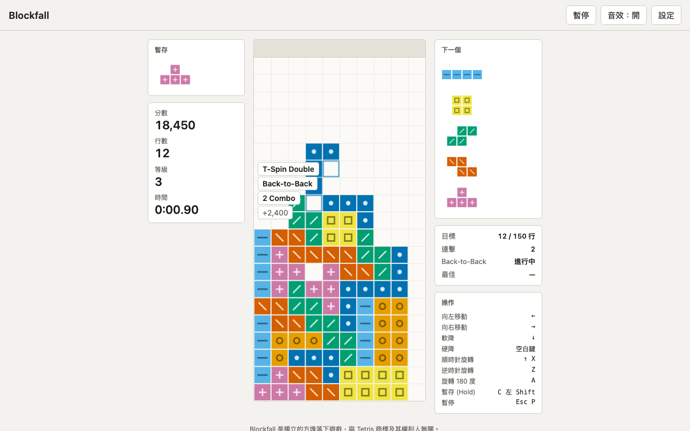

# Blockfall
A falling-block puzzle game that follows modern guideline rules (SRS, 7-bag, hold, T-Spin, replays), in plain JavaScript with zero dependencies.

照現代規則做的方塊落下遊戲。純 HTML / JavaScript，不需要安裝任何套件，也不需要建置。



**線上試玩：https://useless-husband.github.io/blockfall/**

> 「Tetris」是其權利人的商標。Blockfall 是一個獨立製作的方塊落下遊戲，與該商標及其權利人無關，因此取名 Blockfall。

## 功能

- 10×20 盤面（上方另有 2 列隱藏緩衝）、7 種方塊、7-bag 隨機
- SRS 旋轉系統，含完整踢牆表（I 方塊使用獨立的表），可選的 180 度旋轉
- Hold（每個方塊只能用一次）、預覽接下來 5 個、落點影子（Ghost）
- 鎖定延遲 0.5 秒，移動或旋轉最多重置 15 次
- DAS / ARR / 軟降速度可在設定調整；硬降
- 計分：單消到四消、T-Spin（含 Mini）、Back-to-Back、Combo、完美清除（Perfect Clear）；畫面只用文字短暫顯示動作名稱
- 四種模式：馬拉松、40 行競速、2 分鐘限時、禪模式（不會輸）；每個模式在瀏覽器裡保存最佳紀錄
- 重播：記錄種子與輸入，可重播整局，能暫停、0.5× 到 8× 調速，也能匯出、匯入重播檔
- 暫停（Esc / P）、視窗失去焦點自動暫停、音效開關、按鍵自訂、高對比模式、淺色 / 深色主題
- 每種方塊除了顏色，還有一個小圖樣，色盲也能分辨
- 手機可玩：觸控手勢加畫面按鈕

## 怎麼玩

預設按鍵（都可以在「設定」裡修改）：

| 動作 | 按鍵 |
| --- | --- |
| 向左 / 向右移動 | ← / → |
| 軟降 | ↓ |
| 硬降 | 空白鍵 |
| 順時針旋轉 | ↑ 或 X |
| 逆時針旋轉 | Z |
| 旋轉 180 度 | A |
| 暫存（Hold） | C 或 左 Shift |
| 暫停 / 繼續 | Esc 或 P |
| 開始（選單中） | Enter |

觸控操作：

| 手勢 | 動作 |
| --- | --- |
| 手指在盤面左右滑 | 左右移動（每滑過一格移一格） |
| 點一下 | 順時針旋轉 |
| 慢慢往下滑並停住 | 軟降 |
| 快速往下一撥 | 硬降 |
| 畫面按鈕 | 暫存、逆時針 / 順時針旋轉、暫停 |

## 安裝與執行

不需要安裝任何東西。

1. 下載或 clone 這個專案。
2. 因為程式使用 ES module，瀏覽器不允許直接雙擊 `index.html`（`file://`）載入，需要用一個本機伺服器。最簡單的方式，在專案資料夾打開終端機，輸入：

   ```sh
   python3 -m http.server 8000
   ```

3. 用瀏覽器開啟 http://localhost:8000 。

如果有裝 Node.js，也可以用 `npx serve .` 之類的靜態伺服器。要發佈到 GitHub Pages，直接把 main 分支的根目錄設為來源即可。

## 專案結構

```
index.html        頁面
style.css         樣式（淺色 / 深色 / 高對比）
src/
  pieces.js       方塊形狀、SRS 踢牆表
  board.js        盤面、碰撞、消行
  rng.js          可設種子的亂數與 7-bag
  scoring.js      計分表與重力公式
  engine.js       決定性遊戲引擎（無 DOM、無真實時鐘）
  replay.js       重播記錄、驗證與播放器
  loop.js         固定時間步長迴圈
  storage.js      最佳紀錄與設定的保存
  keys.js         預設按鍵與改鍵
  render.js       canvas 繪圖
  touch.js        觸控手勢
  audio.js        WebAudio 合成音效
  app.js          瀏覽器端的串接（輸入、選單、畫面）
test/             node --test 測試
docs/screenshot.png
```

遊戲邏輯與畫面完全分離：`engine.js` 不碰 DOM，也不用 `Math.random` 或真實時間，每呼叫一次 `step()` 就前進 1/60 秒。畫面端用 `loop.js` 把不固定的畫面更新頻率轉成固定的邏輯步長。

## 如何跑測試

需要 Node.js 22 以上，沒有任何依賴要裝：

```sh
node --test "test/*.test.js"
```

測試涵蓋：每種方塊每個方向的踢牆（依 wiki 公開資料）、7-bag 分布、消行與重力、T-Spin 判定（含 T-Spin Triple、Mini、第五個踢牆的升級規則）、B2B / Combo / 完美清除計分、鎖定延遲與移動重置、DAS / ARR 時序（含假時鐘）、Hold 限制、Block out / Lock out、四種模式，以及重播的決定性（相同種子與輸入，結果的雜湊值完全相同）。

## 原理簡介

**SRS 旋轉。** 每個方塊有 4 個朝向（0、R、2、L）。旋轉時先試原位，放不下就依序嘗試該轉換的踢牆偏移（JLSTZ 與 I 各有一張表，每個轉換 5 個測試，O 不會位移）。第一個放得下的位置就是結果。180 度旋轉另有 6 個偏移的表。

**7-bag。** 把 7 種方塊洗牌成一袋，發完再洗下一袋，所以不會長時間拿不到某種方塊，同一種方塊最多相隔 13 個。洗牌用固定種子的 mulberry32，相同種子必定得到相同順序。

**T-Spin。** 最後一個動作必須是旋轉，且 T 方塊 3×3 範圍的四個角中至少有 3 個被佔（牆與地板算被佔）。T 尖端方向那一側的兩個角都被佔是完整 T-Spin，否則是 Mini；但如果是用第 5 個踢牆位置轉進去（例如 T-Spin Triple 的轉法），一律算完整。

**計分。** 單消 100、雙消 300、三消 500、四消 800；T-Spin 0 / 1 / 2 / 3 行為 400 / 800 / 1200 / 1600，Mini 為 100 / 200 / 400；全部乘以目前等級。困難的清除（四消與 T-Spin 消行）連續發生時，第二次起 ×1.5（Back-to-Back）。Combo 每次連續消行加 50 × 連擊數 × 等級。完美清除另加 800 / 1200 / 1800 / 2000，連續 B2B 的四消完美清除為 3200。軟降每格 1 分，硬降每格 2 分。

**重力。** 每格下落秒數 = (0.8 − (等級 − 1) × 0.007)^(等級 − 1)。馬拉松每消 10 行升一級，上限 15 級，消滿 150 行過關。

**鎖定延遲。** 方塊碰到地面後 0.5 秒鎖定。在地面上成功移動或旋轉會重置計時，最多 15 次；落到比之前更低的位置時，次數重新計算。

**重播。** 一局遊戲完全由「種子、模式、操作設定、輸入序列」決定，輸入序列記錄的是（第幾個邏輯步、動作、按下或放開）。重播就是用同樣的引擎把這些輸入重新餵一遍。

## 已知限制

- 沒有 IRS / IHS（預先旋轉、預先 Hold）。
- 沒有連線對戰與排行榜，最佳紀錄只存在本機瀏覽器。
- 控制器（手把）尚未支援。
- 觸控手勢的手感依裝置而異。

## 授權

MIT，見 [LICENSE](LICENSE)。
